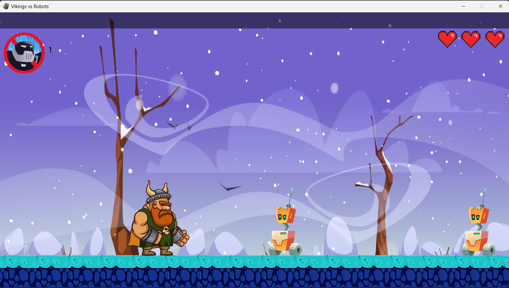

<!DOCTYPE html>
<html lang="en">
<head>
    <meta charset="UTF-8">
    <meta name="viewport" content="width=device-width, initial-scale=1.0">
</head>
<body>
    <h1>2D Platformer Game</h1>
    
     
    <h2>Table of Contents</h2>
    <ul>
        <li><a href="#introduction">Introduction</a></li>
        <li><a href="#features">Features</a></li>
        <li><a href="#installation">Installation</a></li>
        <li><a href="#how-to-play">How to Play</a></li>
        <li><a href="#controls">Controls</a></li>
        <li><a href="#credits">Credits</a></li>
    </ul>
     
    <h2 id="introduction">Introduction</h2>
    
Welcome to the 2D Platformer Game! This game is a project developed for an advanced programming course at the university. It is built using JavaFX and showcases fundamental game development concepts such as character movement, jumping, and attacking enemies.

     
    <h2 id="features">Features</h2>
    <ul>
        <li>Classic 2D platformer gameplay</li>
        <li>Smooth character movement and jumping mechanics</li>
        <li>Enemy attack system</li>
        <li>Simple and intuitive controls</li>
        <li>Customizable and extendable codebase</li>
    </ul>
     
    <h2 id="installation">Installation</h2>
    
To run the game locally, follow these steps:

    <ol>
        <li><strong>Clone the repository:</strong></li>
        <pre><code>git clone https://github.com/Am1nWithOne/Javafx-2D-game.git</code></pre>
        <li><strong>Navigate to the project directory:</strong></li>
        <pre><code>cd Javafx-2D-game</code></pre>
        <li><strong>Ensure you have Java 17 and JavaFX installed:</strong></li>
        
Download and install Java 17 from the <a href="https://jdk.java.net/17/" target="_blank">official JDK website</a>.

        <li><strong>Compile the project:</strong></li>
        
Ensure you have JavaFX SDK. Then, use your preferred IDE or command line to compile the project. The source code is located in the <code>demo1/src/main/java/com/example/demo1</code> directory.

        <pre><code>javac --module-path path/to/javafx-sdk/lib --add-modules javafx.controls,javafx.fxml -d bin demo1/src/main/java/com/example/demo1/*.java</code></pre>
        <li><strong>Run the game:</strong></li>
        <pre><code>java --module-path path/to/javafx-sdk/lib --add-modules javafx.controls,javafx.fxml -cp bin com.example.demo1.Main</code></pre>
    </ol>
     
    <h2 id="how-to-play">How to Play</h2>
    
The objective of the game is to navigate through the levels, avoid obstacles, and defeat enemies using the attack mechanic.

     
    <h2 id="controls">Controls</h2>
    <ul>
        <li><strong>W Key:</strong> Jump</li>
        <li><strong>A Key:</strong> Attack</li>
    </ul>
     
    <h2 id="credits">Credits</h2>
    
This game was developed by <a href="https://github.com/Am1nWithOne">Am1n</a> as part of an advanced programming course at SUT.

</body>
</html>
